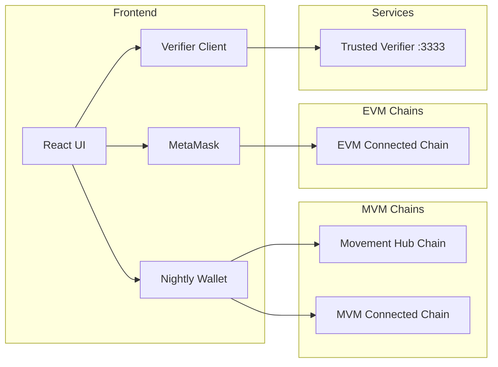
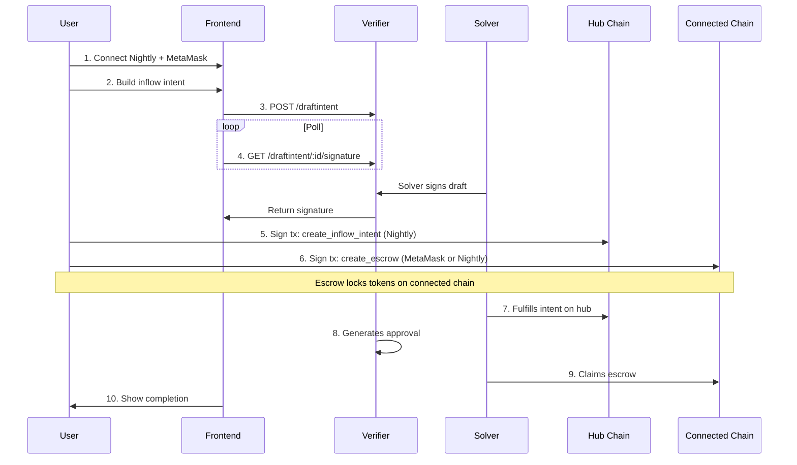
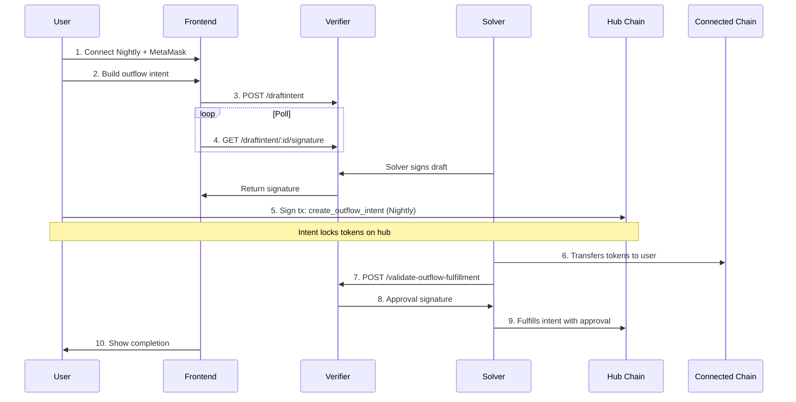

# Intent Framework Frontend

## Overview

A Next.js 14 frontend for the cross-chain intent protocol, enabling users to:

- Connect Nightly wallet (for MVM chains) + MetaMask (for EVM chains)
- Create inflow/outflow intents
- Submit drafts to the verifier and poll for solver signatures
- Track intent lifecycle through completion

## Architecture



## Key Files

- `frontend/src/app/layout.tsx` - Wallet providers (Nightly + wagmi)
- `frontend/src/app/page.tsx` - Main intent creation page
- `frontend/src/lib/verifier.ts` - Verifier API client
- `frontend/src/lib/types.ts` - Protocol types (DraftIntent, IntentStatus)
- `frontend/src/components/wallet/` - Wallet connection UI
- `frontend/src/components/intent/IntentBuilder.tsx` - Intent creation form
- `frontend/src/components/status/StatusTracker.tsx` - Intent lifecycle tracker

## Documentation Approach

Following repo's three-layer pattern:

- `frontend/README.md` - Quick start, build commands, link to docs
- `docs/frontend/README.md` - Overview, links to existing protocol.md for flows
- Update `docs/README.md` - Add Frontend to Components list

No duplication of protocol flows - link to [protocol.md](docs/protocol.md) instead.

## Inflow User Flow

Tokens locked on connected chain, received on hub.



## Outflow User Flow

Tokens locked on hub, received on connected chain.



## Tech Stack

- **Framework**: Next.js 14 (App Router)
- **MVM Wallet**: Nightly via @nightlylabs/aptos-wallet-adapter-react
- **EVM Wallet**: MetaMask via wagmi + viem + @tanstack/react-query
- **Styling**: Tailwind CSS
- **Design**: Dark theme, monospace typography, terminal aesthetic

## Implementation Phases

### Phase 1: Project Setup

- Initialize Next.js with TypeScript
- Configure Tailwind with dark theme
- Set up wallet providers
- Create `frontend/README.md`
- **Commit and test**

### Phase 2: Wallet Connection

- Nightly adapter integration (for MVM Hub + MVM Connected chains)
- MetaMask integration via wagmi (for EVM Connected chains)
- Unified wallet status display
- **Commit and test**

### Phase 3: Verifier API Client

- Type-safe API client for all endpoints
- Polling hooks for signature/status
- Error handling
- **Commit and test**

### Phase 4: Intent Builder

- Flow type selector (inflow/outflow)
- Chain + token selection
- Amount inputs with validation
- Expiry configuration
- **Commit and test**

### Phase 5: Status Tracker

- Visual step progression (draft, signed, on-chain, escrow, fulfilled, complete)
- Real-time polling updates
- Transaction hash links
- **Commit and test**

### Phase 6: Transaction Signing

- Inflow: create_inflow_intent (hub) + create_escrow (connected)
- Outflow: create_outflow_intent (hub)
- Handle both MVM and EVM connected chains
- **Commit and test**

### Phase 7: Documentation

- Create `docs/frontend/README.md` (link to protocol.md for flows)
- Update `docs/README.md` to add Frontend component
- **Commit and test**

## Environment Variables

```javascript
NEXT_PUBLIC_VERIFIER_URL=http://localhost:3333
NEXT_PUBLIC_MVM_HUB_RPC=https://testnet.movementnetwork.xyz
NEXT_PUBLIC_EVM_RPC=https://...
```

