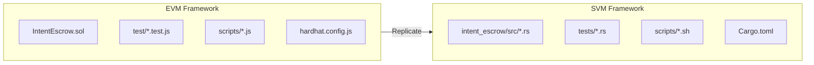

# Solana SVM Intent Framework

## Overview

Replicate the EVM Intent Framework for Solana SVM using native Solana development. This includes the escrow program, all tests, utility scripts, documentation, and E2E test infrastructure.

**Structured in 11 phases with committable checkpoints.**

## Architecture



## Key Technical Differences

| Aspect | EVM | SVM |
| ------ | --- | --- |
| Token Standard | ERC20 | SPL Token |
| Signatures | ECDSA (secp256k1) | Ed25519 |
| Amount Type | uint256 | u64 |
| Storage | Mapping | PDA Accounts |
| Time | block.timestamp | Clock sysvar |
| Test Framework | Hardhat/Mocha | solana-program-test |

---

## Commit Workflow

**CRITICAL: Each phase must be completed and committed before moving to the next phase.**

### Commit Process

1. **Complete all tasks in the phase**
2. **Run tests** (ONLY if changes affect existing tests) to ensure changes work correctly
3. **Stage files** (user must stage files - AI should NOT run `git add`)
4. **Create commit** with the specified commit message format
5. **Include test results** in commit message ONLY if tests were run (see format below)
6. **Only then proceed to the next phase**

### Commit Message Format

Follow the conventions in [`.cursor/rules`](../.cursor/rules):

**If tests were run:**

```bash
git commit -m "<type>: <description>

- <more detailed points if needed (optional)>

Tests pass: Verifier (Rust) <number>, Solver (Rust) <number>, Move <amount>, EVM <amount>, SVM <number>, Frontend <number>"
```

**If tests were NOT run (e.g., project setup, docs only, no test-affecting changes):**

```bash
git commit -m "<type>: <description>

- <more detailed points if needed (optional)>"
```

**Important:**

- **NEVER run `git add` or `git add -A`** - files must be staged by the user
- **Only run tests if the changes affect existing test code** (e.g., adding new tests, modifying code that has tests)
- **Do NOT run tests for:** project setup, documentation-only changes, configuration files, or other non-code changes
- **If sandbox prevents test execution**, ask user for help or skip tests (don't include "Tests pass:" line)
- **Only include "Tests pass:" line if tests were actually run**
- Use conventional commit types: `feat:`, `fix:`, `refactor:`, `test:`, `docs:`, `chore:`

### Getting Test Counts

Run test summary script:

```bash
./testing-infra/run-all-unit-tests.sh
```

Or get individual counts:

```bash
# SVM tests
nix develop -c bash -c "cd svm-intent-framework && ./scripts/test.sh" 2>&1 | grep -oE "[0-9]+ test" | awk '{print $1}'
```

---

## Phase 1: Project Setup ✅

**Commit: `chore: initialize svm-intent-framework project structure`**

- [x] Save this plan to `.cursor/plans/plan.md`
- [x] Create `svm-intent-framework/` directory structure:

```text
svm-intent-framework/
├── Cargo.toml
├── README.md
├── scripts/
│   ├── build.sh
│   └── test.sh
└── programs/
    └── intent_escrow/
        ├── Cargo.toml
        └── src/
            ├── lib.rs
            ├── instruction.rs
            ├── processor.rs
            ├── state.rs
            └── error.rs
```

---

## Phase 2: Core Program ✅

**Commit: `feat(svm): implement IntentEscrow program`**

- [x] Implement IntentEscrow program in `programs/intent_escrow/src/`
- [x] Add build script with Solana CLI compatibility workarounds
- [x] Document toolchain constraints (Cargo.lock v3, edition2024 avoidance)

**Escrow Account Structure:**

```rust
pub struct Escrow {
    pub requester: Pubkey,
    pub token_mint: Pubkey,
    pub amount: u64,
    pub is_claimed: bool,
    pub expiry: i64,
    pub reserved_solver: Pubkey,
    pub intent_id: [u8; 32],
}
```

**Instructions (matching Solidity):**

- `create_escrow(intent_id, amount, reserved_solver)` - Atomic create + deposit
- `claim(signature)` - Ed25519 signature verification
- `cancel()` - Refund after expiry

**Events:** Program logs via `msg!()` - EscrowInitialized, EscrowClaimed, EscrowCancelled

**Errors:** EscrowAlreadyClaimed, EscrowDoesNotExist, NoDeposit, UnauthorizedRequester, InvalidSignature, UnauthorizedVerifier, EscrowExpired, EscrowNotExpiredYet

---

## Phase 3: Test Helpers ✅

**Commit: `test(svm): add Rust test helpers`**

- [x] Create `tests/common.rs` - Test fixtures, SPL token utilities, instruction builders
- [x] Helper functions: `program_test()`, `setup_basic_env()`, `create_escrow_ix()`, etc.

---

## Phase 4: Core Tests ✅

**Commit: `test(svm): add core escrow tests`**

- [x] Create `tests/initialization.rs` - Verifier setup, escrow creation, duplicate prevention
- [x] Create `tests/deposit.rs` - Token deposits, balance verification
- [x] Create `tests/claim.rs` - Signature verification, replay prevention, double-claim prevention
- [x] Create `tests/cancel.rs` - Expiry enforcement, refund flow

---

## Phase 5: Extended Tests ✅

**Commit: `test(svm): add extended test coverage`**

- [x] Create `tests/expiry.rs` - Time-based logic
- [x] Create `tests/cross_chain.rs` - Intent ID format handling
- [x] Create `tests/edge_cases.rs` - Boundary values, concurrent operations
- [x] Create `tests/error_conditions.rs` - Error handling
- [x] Create `tests/integration.rs` - Full workflows
- [x] Create `tests/scripts.rs` - Script functionality placeholder

---

## Phase 6: Utility Scripts ✅

**Commit: `feat(svm): add CLI and utility scripts`**

- [x] Create deployment script (`svm-intent-framework/scripts/deploy.sh`)
- [x] Create escrow interaction scripts (`svm-intent-framework/scripts/*-escrow.sh`)
- [x] Add CLI tool for on-chain interactions (`svm-intent-framework/tools/intent_escrow_cli`)

---

## Phase 7: Integration (Verifier + Solver) ✅

**Commit: `feat: add SVM support to verifier and solver`**

**Documentation:** Update `docs/` and `taskmaster/docs/` to reflect SVM integration.

### Verifier

New files (following EVM/MVM pattern):

- [x] `src/svm_client.rs` - SVM RPC client
  - Solana JSON-RPC calls (`getAccountInfo`, `getSlot`, etc.)
  - Parse Borsh-serialized escrow PDA state
  - Ed25519 signature generation for intent IDs
- [x] `src/api/inflow_svm.rs` - Inflow SVM API handlers
- [x] `src/api/outflow_svm.rs` - Outflow SVM API handlers
- [x] `src/monitor/inflow_svm.rs` - Poll SVM escrow events
- [x] `src/monitor/outflow_svm.rs` - Monitor SVM escrow state changes
- [x] `src/validator/inflow_svm.rs` - Validate SVM escrow solver matches registry
- [x] `src/validator/outflow_svm.rs` - Validate SVM outflow fulfillment

Updates to existing files:

- [x] `src/config/mod.rs` - Add `SvmChainConfig` struct
- [x] `config/verifier.template.toml` - Add SVM chain config section
- [x] `src/api/mod.rs` - Register SVM routes
- [x] `src/monitor/mod.rs` - Register SVM monitor
- [x] `src/validator/mod.rs` - Register SVM validators

Tests:

- [x] `tests/svm/` - SVM-specific test directory
- [x] `tests/svm/crypto_tests.rs` - Ed25519 signature tests
- [x] `tests/svm/validator_tests.rs` - SVM validation tests
- [x] `tests/svm/escrow_parsing_tests.rs` - Borsh escrow parsing tests

### Solver

New files (following EVM pattern):

- [x] `src/chains/connected_svm.rs` - SVM chain client
  - Query escrow PDA state via RPC
  - Build claim transactions (with Ed25519 verify instruction)
  - SPL token balance checking
  - Transaction signing and submission

Updates to existing files:

- [x] `src/config.rs` - Add `SvmChainConfig` struct
- [x] `config/solver.template.toml` - Add SVM chain config section
- [x] `src/chains/mod.rs` - Register SVM chain
- [x] `src/service/inflow.rs` - Handle SVM inflow intents
- [x] `src/service/outflow.rs` - Handle SVM outflow intents

Tests:

- [x] `tests/svm/chain_client_tests.rs` - SVM client tests

---

## Phase 8: E2E Infrastructure

**Commit: `test: add SVM E2E test infrastructure`**

**Documentation:** ✅ Updated `docs/` and `taskmaster/docs/` to reflect SVM E2E testing.

### chain-connected-svm

- [x] Create `testing-infra/ci-e2e/chain-connected-svm/setup-chain.sh` - Start solana-test-validator
- [x] Create `testing-infra/ci-e2e/chain-connected-svm/stop-chain.sh` - Stop validator
- [x] Create `testing-infra/ci-e2e/chain-connected-svm/cleanup.sh` - Full cleanup
- [x] Create `testing-infra/ci-e2e/chain-connected-svm/deploy-contract.sh` - Deploy program
- [x] Create `testing-infra/ci-e2e/chain-connected-svm/setup-requester-solver.sh` - Fund test accounts
- [x] Create `testing-infra/ci-e2e/chain-connected-svm/utils.sh` - SVM-specific utilities

### e2e-tests-svm

- [x] Create `testing-infra/ci-e2e/e2e-tests-svm/run-tests-inflow.sh` - Full inflow E2E test
- [x] Create `testing-infra/ci-e2e/e2e-tests-svm/run-tests-outflow.sh` - Full outflow E2E test
- [x] Create `testing-infra/ci-e2e/e2e-tests-svm/balance-check.sh` - SPL token balance verification
- [x] Create `testing-infra/ci-e2e/e2e-tests-svm/start-verifier.sh` - Start verifier
- [x] Create `testing-infra/ci-e2e/e2e-tests-svm/start-solver.sh` - Start solver
- [x] Create `testing-infra/ci-e2e/e2e-tests-svm/README.md` - Documentation

### Shared utilities

- [x] Create `testing-infra/ci-e2e/util_svm.sh` - SVM-specific shell utilities

### CI Integration

- [x] Update `.github/workflows/e2e_tests.yml` - Add SVM E2E jobs
  - `svm-chain-inflow` job using `run-tests-inflow.sh`
  - `svm-chain-outflow` job using `run-tests-outflow.sh`

---

## Phase 9: Frontend Integration

**Commit: `feat: add SVM support to frontend`**

**Documentation:** Update `docs/` and `taskmaster/docs/` to reflect SVM frontend support.

### Dependencies

- [ ] Add `@solana/web3.js` - Solana SDK
- [ ] Add `@solana/wallet-adapter-*` - Wallet adapter packages
- [ ] Add `@solana/spl-token` - SPL token utilities

### New files

- [ ] `src/components/wallet/SvmWalletConnector.tsx` - Phantom wallet connection component
- [ ] `src/lib/svm-escrow.ts` - SVM escrow utilities
  - PDA derivation for escrow and vault
  - Instruction building (CreateEscrow, Claim, Cancel)
  - Intent ID formatting for SVM
- [ ] `src/lib/svm-transactions.ts` - SVM transaction signing/submission via Phantom

### Updates to existing files

- [ ] `src/config/chains.ts` - Add SVM chain configs (devnet, program ID)
- [ ] `src/config/tokens.ts` - Add SPL token configurations
- [ ] `src/lib/balances.ts` - Add `fetchSvmBalance()` for SPL tokens
- [ ] `src/lib/types.ts` - Add SVM-specific types
- [ ] `src/components/providers.tsx` - Add Solana wallet adapter provider
- [ ] `src/components/intent/IntentBuilder.tsx` - Handle SVM inflow/outflow flows
  - SVM wallet state management
  - SVM escrow creation flow
  - SVM transaction submission
  - SVM escrow status display

### Notes

- If SVM behavior deviates from EVM UX/flow, add an explicit in-code comment explaining the deviation and why it is required.

---

## Phase 10: Nix Integration ✅

**Commit: `chore: add Solana to nix dev shell`**

- [x] Update `flake.nix` - Add Solana CLI installation via rustup
- [x] Nix Rust for Verifier/Solver, rustup for SVM builds

---

## Phase 11: Documentation ✅

**Commit: `docs: add SVM framework documentation`**

- [x] Create `docs/svm-intent-framework/README.md` - Full SVM framework docs
- [x] Update root `README.md` with SVM component link and test commands
- [x] Create `docs/framework-extension-guide.md` - Guide for adding new frameworks
- [x] Add SVM tests to CI workflow

---

## Commands

```bash
# Enter dev shell (includes Solana)
nix develop

# Build program
cd svm-intent-framework
./scripts/build.sh

# Run tests
./scripts/test.sh

# Or directly with cargo
cargo test -p intent_escrow --tests
```
