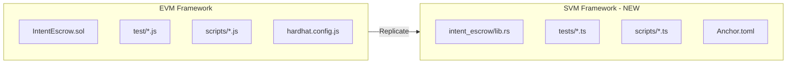

# Solana SVM Intent Framework

## Overview

Replicate the EVM Intent Framework for Solana SVM using the Anchor framework. This includes the escrow program, all tests, utility scripts, documentation, and E2E test infrastructure.

**Structured in 9 phases with committable checkpoints.**

## Architecture



## Key Technical Differences

| Aspect | EVM | SVM |
|--------|-----|-----|
| Token Standard | ERC20 | SPL Token |
| Signatures | ECDSA (secp256k1) | Ed25519 |
| Amount Type | uint256 | u64 |
| Storage | Mapping | PDA Accounts |
| Time | block.timestamp | Clock sysvar |

---

## Commit Workflow

**CRITICAL: Each phase must be completed and committed before moving to the next phase.**

### Commit Process

1. **Complete all tasks in the phase**
2. **Run tests** (ONLY if changes affect existing tests) to ensure changes work correctly
3. **Stage files** (user must stage files - AI should NOT run `git add`)
4. **Create commit** with the specified commit message format
5. **Include test results** in commit message ONLY if tests were run (see format below)
6. **Only then proceed to the next phase**

### Commit Message Format

Follow the conventions in [`.cursor/rules`](../.cursor/rules):

**If tests were run:**
```bash
git commit -m "<type>: <description>

- <more detailed points if needed (optional)>

Tests pass: Verifier (Rust) <number>, Solver (Rust) <number>, Move <amount>, EVM <amount>, SVM <number>, Frontend <number>"
```

**If tests were NOT run (e.g., project setup, docs only, no test-affecting changes):**
```bash
git commit -m "<type>: <description>

- <more detailed points if needed (optional)>"
```

**Important:**
- **NEVER run `git add` or `git add -A`** - files must be staged by the user
- **Only run tests if the changes affect existing test code** (e.g., adding new tests, modifying code that has tests)
- **Do NOT run tests for:** project setup, documentation-only changes, configuration files, or other non-code changes
- **If sandbox prevents test execution**, ask user for help or skip tests (don't include "Tests pass:" line)
- **Only include "Tests pass:" line if tests were actually run**
- Use conventional commit types: `feat:`, `fix:`, `refactor:`, `test:`, `docs:`, `chore:`

### Getting Test Counts

Run test summary script:
```bash
./.cursor/test-summary.sh
```

Or get individual counts:
```bash
# SVM tests (when implemented)
nix develop -c bash -c "cd svm-intent-framework && anchor test" 2>&1 | grep -oE "[0-9]+ passing" | awk '{print $1}'
```

---

## Phase 1: Project Setup ✅

**Commit: `chore: initialize svm-intent-framework project structure`**

- [x] Save this plan to `.cursor/plans/plan.md`
- [x] Create `svm-intent-framework/` directory structure:

```
svm-intent-framework/
├── Anchor.toml
├── Cargo.toml
├── package.json
├── tsconfig.json
├── README.md
└── programs/
    └── intent_escrow/
        ├── Cargo.toml
        └── src/
            └── lib.rs (stub)
```

---

## Phase 2: Core Program ✅

**Commit: `feat(svm): implement IntentEscrow program with toolchain workarounds`**

- [x] Implement IntentEscrow program in `programs/intent_escrow/src/lib.rs`
- [x] Add build script with Anchor 0.29.0 / Solana CLI compatibility shims
- [x] Document toolchain constraints (Cargo.lock v3, edition2024 avoidance)

**Escrow Account Structure:**

```rust
#[account]
pub struct Escrow {
    pub requester: Pubkey,
    pub token_mint: Pubkey,
    pub amount: u64,
    pub is_claimed: bool,
    pub expiry: i64,
    pub reserved_solver: Pubkey,
    pub intent_id: [u8; 32],
    pub bump: u8,
}
```

**Instructions (matching Solidity):**

- `create_escrow(intent_id, amount, reserved_solver)` - Atomic create + deposit
- `claim(signature)` - Ed25519 signature verification
- `cancel()` - Refund after expiry

**Events:** EscrowInitialized, EscrowClaimed, EscrowCancelled

**Errors:** EscrowAlreadyClaimed, EscrowDoesNotExist, NoDeposit, UnauthorizedRequester, InvalidSignature, UnauthorizedVerifier, EscrowExpired, EscrowNotExpiredYet

---

## Phase 3: Test Helpers ✅

**Commit: `test(svm): add test helpers and setup`**

- [x] Create `tests/helpers/setup.ts` - Test fixtures (provider, program, accounts)
- [x] Create `tests/helpers/token.ts` - SPL token utilities (create mint, mint tokens)
- [x] Create `tests/helpers/index.ts` - Re-exports

---

## Phase 4: Core Tests ✅

**Commit: `test(svm): add core escrow tests`**

- [x] Create `tests/initialization.test.ts` - Verifier setup, escrow creation, duplicate prevention
- [x] Create `tests/deposit.test.ts` - Token deposits, balance verification
- [x] Create `tests/claim.test.ts` - Signature verification, replay prevention, double-claim prevention
- [x] Create `tests/cancel.test.ts` - Expiry enforcement, refund flow

---

## Phase 5: Extended Tests

**Commit: `test(svm): add extended test coverage`**

- [ ] Create `tests/expiry.test.ts` - Time-based logic
- [ ] Create `tests/cross-chain.test.ts` - Intent ID format handling
- [ ] Create `tests/edge-cases.test.ts` - Boundary values, concurrent operations
- [ ] Create `tests/error-conditions.test.ts` - Error handling
- [ ] Create `tests/integration.test.ts` - Full workflows
- [ ] Create `tests/scripts.test.ts` - Script functionality

---

## Phase 6: Utility Scripts

**Commit: `feat(svm): add utility scripts`**

- [ ] Create `scripts/deploy.ts` - Deploy IntentEscrow program
- [ ] Create `scripts/create-escrow.ts` - Create escrow for intent
- [ ] Create `scripts/claim-escrow.ts` - Claim with verifier signature
- [ ] Create `scripts/get-escrow-status.ts` - Query escrow state
- [ ] Create `scripts/mint-token.ts` - Mint test SPL tokens
- [ ] Create `scripts/get-token-balance.ts` - Check SPL token balance
- [ ] Create `scripts/transfer-with-intent-id.ts` - Transfer with intent ID in memo

---

## Phase 7: E2E Infrastructure

**Commit: `test(svm): add E2E test infrastructure`**

**chain-connected-svm/**

- [ ] Create `testing-infra/ci-e2e/chain-connected-svm/setup-chain.sh` - Start solana-test-validator
- [ ] Create `testing-infra/ci-e2e/chain-connected-svm/stop-chain.sh` - Stop validator
- [ ] Create `testing-infra/ci-e2e/chain-connected-svm/cleanup.sh` - Full cleanup
- [ ] Create `testing-infra/ci-e2e/chain-connected-svm/deploy-contract.sh` - Deploy Anchor program
- [ ] Create `testing-infra/ci-e2e/chain-connected-svm/setup-requester-solver.sh` - Fund test accounts
- [ ] Create `testing-infra/ci-e2e/chain-connected-svm/utils.sh` - SVM-specific utilities

**e2e-tests-svm/**

- [ ] Create `testing-infra/ci-e2e/e2e-tests-svm/run-tests-inflow.sh` - Full inflow E2E test
- [ ] Create `testing-infra/ci-e2e/e2e-tests-svm/run-tests-outflow.sh` - Full outflow E2E test
- [ ] Create `testing-infra/ci-e2e/e2e-tests-svm/balance-check.sh` - SPL token balance verification
- [ ] Create `testing-infra/ci-e2e/e2e-tests-svm/start-verifier.sh` - Start verifier
- [ ] Create `testing-infra/ci-e2e/e2e-tests-svm/start-solver.sh` - Start solver
- [ ] Create `testing-infra/ci-e2e/e2e-tests-svm/README.md` - Documentation

**Shared utilities**

- [ ] Create `testing-infra/ci-e2e/util_svm.sh` - SVM-specific shell utilities

---

## Phase 8: Nix Integration ✅

**Commit: `chore: add Solana/Anchor to nix dev shell`**

- [x] Create `solana.nix` - Nix package for Solana CLI + Anchor CLI
- [x] Update `flake.nix` - Add solanaCli to dev shell packages
- [x] Nix Rust for Verifier/Solver, rustup for SVM builds

---

## Phase 9: Documentation

**Commit: `docs: add SVM framework documentation`**

- [ ] Create `docs/svm-intent-framework/README.md` - Full SVM framework docs
- [ ] Update root `README.md` with:
  - SVM component link
  - SVM unit test command
  - SVM E2E test commands

---

## Commands After Implementation

```bash
# Enter dev shell (includes Solana/Anchor)
nix develop

# Build and test
cd svm-intent-framework
anchor build
anchor test

# E2E tests
./testing-infra/ci-e2e/e2e-tests-svm/run-tests-inflow.sh
./testing-infra/ci-e2e/e2e-tests-svm/run-tests-outflow.sh
```
