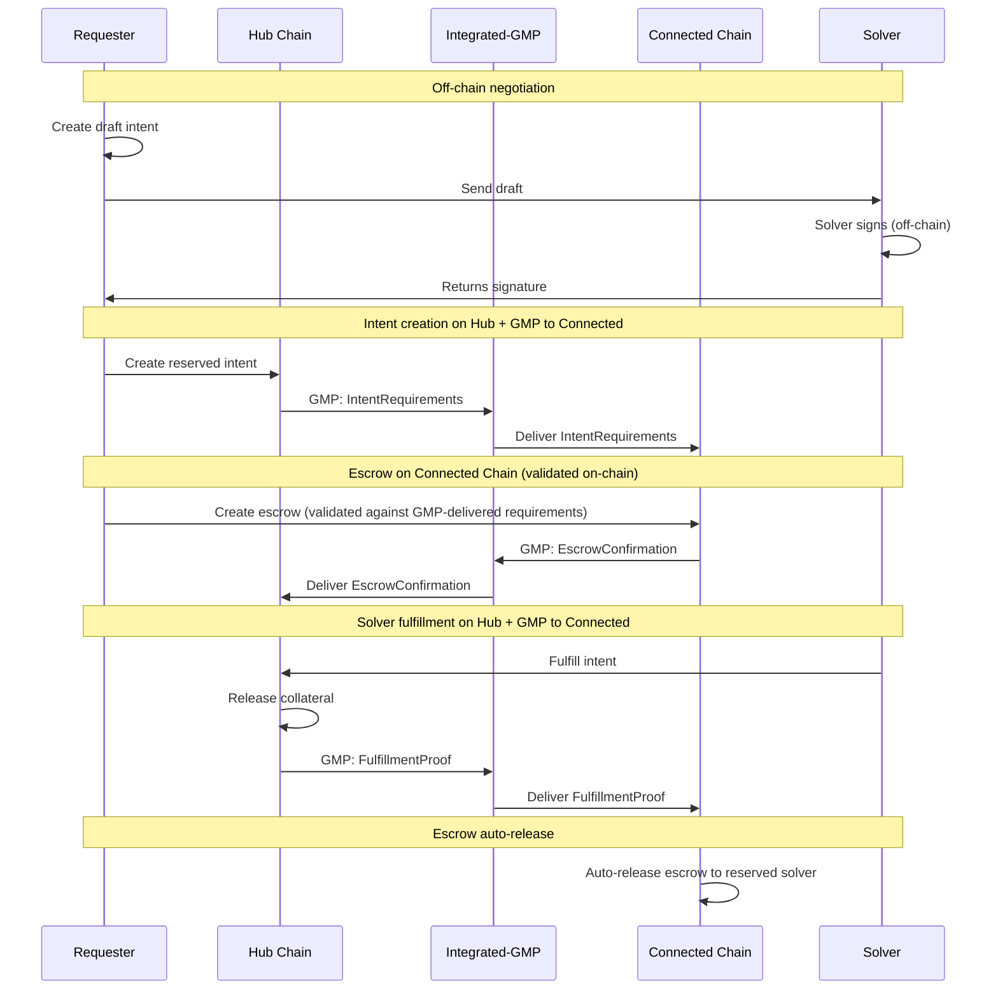

# Conception - Inflow Flow

This document describes the Inflow flow (Connected Chain → Hub). For general concepts, actors, and terminology, see [conception_generic.md](conception_generic.md).

## Use cases

For general use cases applicable to all flows, see [conception_generic.md](conception_generic.md). This section focuses on inflow-specific use cases.

### Users (Requester)

- As a requester, I want to swap some USDcon from a connected chain to M1 chain so that I get my USDhub on M1 chain fast and with low fee.

## Protocol

## Scenarios

### Requester makes an inflow swap intent

0. Given the requester
   - owns the USDcon that they want to transfer
   - owns some MOVE to execute Tx on M1 chain
   - owns offered tokens on connected chain
   - can access the connected chain and M1 chain RPC

1. When the requester wants to realize a swap from connected chain to M1 chain
   - then the requester requests a signed quote from a solver for the desired intent
   - then the requester sends a request-intent Tx to the M1 chain. ( 2) Requester initiates intent protocol step)
   - then the requester sends a Tx to connected chain to transfer the needed USDcon + total fees token to an escrow. ( 1) Requester deposit protocol step)
   - then the requester waits for a confirmation of the swap
   - then the requester has received the requested amount of USDhub in their M1 chain account.

#### Possible issues (Requester)

1. The requester initial escrow transfer is too little or too much.
    - _Mitigation: The escrow contract validates the deposit against GMP-delivered IntentRequirements on-chain. Escrow creation reverts if amounts don't match._
1. The requester didn't get the right expected amount of USDhub.
    - _Mitigation: The hub contract validates fulfillment amount on-chain before emitting the fulfillment event._
1. The escrow deposit on the connected chain fails. How can the requester withdraw their tokens?
    - _Mitigation: The escrow eventually times out and the requester can withdraw their tokens._
1. The requester reuses a Tx already attached to another intent.
    - _Mitigation: The escrow contains the `intent_id`, ensuring each escrow is linked to a unique intent._

#### Questions

- Are the fees in USDcon or in the chain token?

### Solver resolves an inflow swap intent

0. Given the solver
   - is registered in the solver registry on Hub chain
   - owns some MOVE to execute Tx on M1 chain
   - owns enough USDhub on M1 chain
   - can access both chains' RPC
1. When the requester creates a draft intent and sends it to the solver
   - Then the solver signs the draft intent off-chain and returns signature
2. When the requester creates the reserved request-intent on Hub chain
   - Then the solver observes the request-intent and escrow events
   - Then the solver fulfills the request-intent on Hub chain (transfers desired tokens to requester)
   - Then the hub sends a GMP FulfillmentProof to the connected chain
   - Then the escrow auto-releases to the solver on the connected chain

#### Possible issues (Solver)

- The solver doesn't send the right amount of desired tokens to the requester on Hub chain.
  - _Mitigation: The solver submits the amount to the request-intent. The intent reverts if the amount is not the same as the request-intent requested amount._
- The solver doesn't receive the correct amount from escrow on connected chain.
  - _Mitigation: The escrow contract validates the deposit against GMP-delivered IntentRequirements on-chain. Escrow creation reverts if amounts don't match._
- The solver is not notified of new intent request events.
  - _Mitigation: Coordinator receives draft intents from the requester and solvers poll for drafts; integrated-gmp relay delivers GMP messages between chains._
- The solver attempts to fulfill an intent that wasn't reserved for them (on-chain verification prevents this).
  - _Mitigation: The contract rejects the fulfillment if the intent is not reserved for the solver._
- The solver provides the wrong token type on Hub chain.
  - _Mitigation: The contract verifies that the token metadata matches the desired_metadata. The fulfillment transaction aborts if the token type is incorrect._
- The GMP FulfillmentProof is not delivered to the connected chain.
  - _Mitigation: Escrow remains locked until a valid GMP FulfillmentProof is delivered or the escrow expires. On-chain expiry handles stuck intents._

### The requeserter is adverse

0. Given the adversary takes the requester role to do a swap
1. When the adversary wants to extract more funds than the adversary has provided
   - Then the adversary sends a request-intent Tx to the M1 chain.
   - Then the adversary sends a Tx to the connected chain that transfers too little USDcon token to an escrow.
   - Then the adversary hopes to get more USDhub on the M1 chain than they have provided.
      - _Mitigation: The escrow contract validates the deposit against GMP-delivered IntentRequirements on-chain. Escrow creation reverts if amounts don't match._
2. When the adversary attempts to stall the request-intent holding solver funds hostage.
   - Then the adversary reserves the intent
   - Then the adversary takes no action
      - _Mitigation: The request-intent is protected by a timeout mechanism. After timeout, the intent is cancelled and the solver has no obligation to fulfill the intent any longer._

### The solver is adverse

0. Given the adversary takes the solver role to resolve an intent
1. When the adversary attempts to transfer less then the desired amount
   - Then the adversary reserves the intent
   - (Optional) Then the adversary transfers less funds than expected to the requester account.
   - Then the adversary hopes that the intent is fulfilled and the offered amount is transferred to the adversary account on the connected chain.
      - _Mitigation: The smart contract rejects the fulfillment if the amount is less than the request-intent desired amount._
2. When the adversary attemtps to stall the request-intent.
   - Then the adversary reserves the intent
   - Then the adversary takes no action
      - _Mitigation: The request-intent and the escrow is protected by a timeout mechanism. After timeout, the intent and escrow are cancelled and the funds are returned to the requester._

## Error Cases

- **Escrow not created or incorrect**: Connected-chain escrow missing, wrong amount, wrong mint, or wrong reserved solver; escrow creation reverts because it doesn't match GMP-delivered IntentRequirements.
- **Hub fulfillment mismatch**: Solver fulfills intent with incorrect amount or metadata; hub transaction aborts and no fulfillment event is emitted.
- **GMP message not delivered**: Integrated-gmp relay fails to deliver a message; on-chain expiry handles stuck intents.
- **Expiry reached**: Escrow cannot be released after expiry; requester can cancel and reclaim.

## Protocol steps details

Steps 1-3 are generic to all flows. See [conception_generic.md](conception_generic.md#generic-protocol-steps) for details.

### 4) Requester deposit

Requester deposits on the connected chain the offered amount + fee token to an escrow contract. Deposit needs to be tracked by integrated-gmp.
The requester calls the smart contract with the amount of token to swap + the pre-calculated fee.
The contract:

- verify the fee amount
- transfer the amount + fee token to the escrow pool
- use the `intent_id` (from step 3) to associate the escrow with the intent
- save the association with the `intent_id` and the swap amount in a table.

The `intent_id` allows to associate the request-intent with a transfer/escrow on the connected chains to verify that the requester has provided the escrow.

### 5) Solver detects and verifies escrow

The solver monitors escrow events on the connected chain to detect when the requester has deposited funds. The solver verifies that the requester has transferred the correct funds to the escrow and that the intent's data are consistent.

Alternatively, the coordinator monitors the escrow events and the solver can query the coordinator.

### 6) Solver fulfills intent on Hub chain

The solver fulfills the intent on Hub chain by transferring the desired amount and fulfilling the request-intent. The transfer and intent fulfillment are done on-chain using a specific function that links the transfer to the intent.

### 7) Hub sends GMP FulfillmentProof to connected chain

After the solver fulfills the intent on the hub, the hub contract emits a GMP FulfillmentProof message to the connected chain. The integrated-gmp relay delivers this message.

Current implementation uses on-chain GMP messages for all cross-chain communication. The hub sends IntentRequirements (step 2), receives EscrowConfirmation (step 4), and sends FulfillmentProof (this step) — all via GMP.

### 8) Escrow auto-release on connected chain

The connected chain receives the GMP FulfillmentProof and auto-releases the escrow. The offered amount + solver fee is transferred to the solver account.

Deducts fixed protocol fee → Treasury.

### 9) Intent closed

The intent is marked as closed on-chain when the escrow is released.
