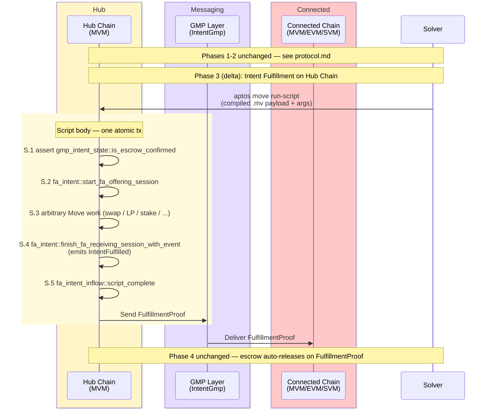
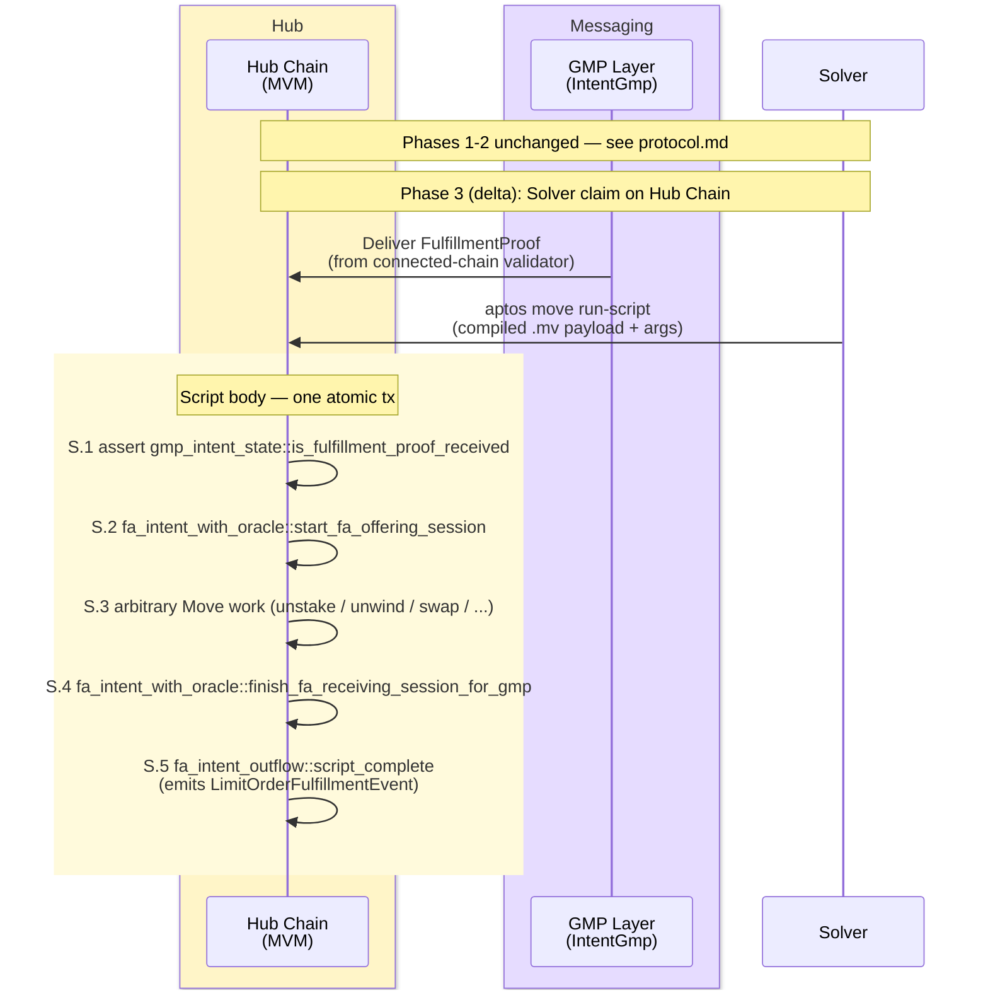

# Programmable Fulfillment

Programmable fulfillment is a variant of the cross-chain intent protocol in which the **hub-side fulfillment step is an arbitrary Move script** rather than a fixed entry-function call. The intent shape, the GMP message types, and the connected-chain side are unchanged. Only the hub-side step that the solver invokes differs.

For the full classic flow (request, escrow, GMP delivery, validation, auto-release) see [Protocol Specification](protocol.md). This document captures only the delta.

## When it applies

The variant is opt-in per fulfillment. A solver can fulfill any inflow or outflow intent on the hub either via the existing entry function (`fulfill_inflow_intent` / `fulfill_outflow_intent`) or via a Move script payload. The choice is the solver's; the framework supports both.

## Why a programmable variant exists

Entry-function fulfillment delivers tokens to a fixed address. A Move script can additionally compose arbitrary on-chain operations between session start and finish — for example, swap into a different asset, deposit into a liquidity pool, and stake the LP receipt — all in one atomic transaction whose success conditions are enforced by the framework's hot-potato session.

## Hub-side delta — Inflow

Phases 1 and 2 of the inflow flow ([Inflow Flow](protocol.md#inflow-flow)) are unchanged. The variant only changes Phase 3 ("Intent Fulfillment on Hub Chain"). The solver submits a Move script whose body executes five steps in one atomic transaction:

- **S.1** — assert `gmp_intent_state::is_escrow_confirmed` (fail fast if the connected-chain escrow proof has not arrived).
- **S.2** — open the inflow session via `fa_intent::start_fa_offering_session`; returns the unlocked FA (zero on inflow) and a non-droppable `Session<Args>` hot-potato.
- **S.3** — arbitrary Move work that constructs the payment fungible asset (e.g. swap, LP entry, stake).
- **S.4** — close the session via `fa_intent::finish_fa_receiving_session_with_event`; deposits the payment to the requester and emits `IntentFulfilled`.
- **S.5** — call `fa_intent_inflow::script_complete`; unregisters the intent and sends the `FulfillmentProof` GMP message to the connected chain.

## Hub-side delta — Outflow

Phases 1 and 2 of the outflow flow ([Outflow Flow](protocol.md#outflow-flow)) are unchanged. The variant only changes Phase 3 ("Intent Auto-Release on Hub Chain"), and only when the solver chooses the script path. After the connected-chain `FulfillmentProof` is delivered to the hub, the solver submits a Move script whose body executes five steps in one atomic transaction:

- **S.1** — assert `gmp_intent_state::is_fulfillment_proof_received` (fail fast if the connected-chain proof has not arrived).
- **S.2** — open the outflow session via `fa_intent_with_oracle::start_fa_offering_session`; returns the user-locked FA and a non-droppable `Session<Args>` hot-potato.
- **S.3** — arbitrary Move work on the unlocked FA (e.g. unstake, unwind LP, swap into the desired asset).
- **S.4** — close the session via `fa_intent_with_oracle::finish_fa_receiving_session_for_gmp` (hub-side payment is the placeholder zero amount; the real value delivery already happened on the connected chain).
- **S.5** — call `fa_intent_outflow::script_complete`; emits `LimitOrderFulfillmentEvent`, unregisters the intent, and removes the GMP state entry.

The delivered-amount and recipient post-condition is enforced on the connected chain by the validation contract before the GMP `FulfillmentProof` is sent back. The hub-side hot-potato (the non-droppable `Session<Args>`) enforces only that the session is consumed within the transaction; no hub-side amount check is added.

## What's added on each side

- **Rust solver** ([solver/src/chains/hub.rs](../solver/src/chains/hub.rs)): `fulfill_inflow_intent_via_script` and `fulfill_outflow_intent_via_script` shell out to `aptos move run-script --compiled-script-path` instead of `move run --function-id`. Args are assembled by `build_run_script_args`.
- **Move (inflow)** ([intent-frameworks/mvm/intent-hub/sources/fa_intent_inflow.move](../intent-frameworks/mvm/intent-hub/sources/fa_intent_inflow.move)): public `script_complete` wrapper that re-exposes the friend-only `intent_registry::unregister_intent` and bundles the cross-chain GMP cleanup (`send_fulfillment_proof`, `remove_intent`).
- **Move (outflow)** ([intent-frameworks/mvm/intent-hub/sources/fa_intent_outflow.move](../intent-frameworks/mvm/intent-hub/sources/fa_intent_outflow.move)): public `script_complete` wrapper that emits `LimitOrderFulfillmentEvent` (the event struct is not constructible across module boundaries) and runs `intent_registry::unregister_intent` + `gmp_intent_state::remove_intent`.

The classic entry-function fulfillment paths (`fulfill_inflow_intent`, `fulfill_outflow_intent`) and all GMP machinery, escrow types, and validation contracts are unchanged.

## Scope

MVM only. Programmable fulfillment runs on the M1 hub side; EVM and SVM connected-chain behavior is untouched.

## See also

- [Protocol Specification](protocol.md) — full classic flow
- [Architecture Differences](architecture/conception/architecture-diff.md) — implementation status against the conception docs
