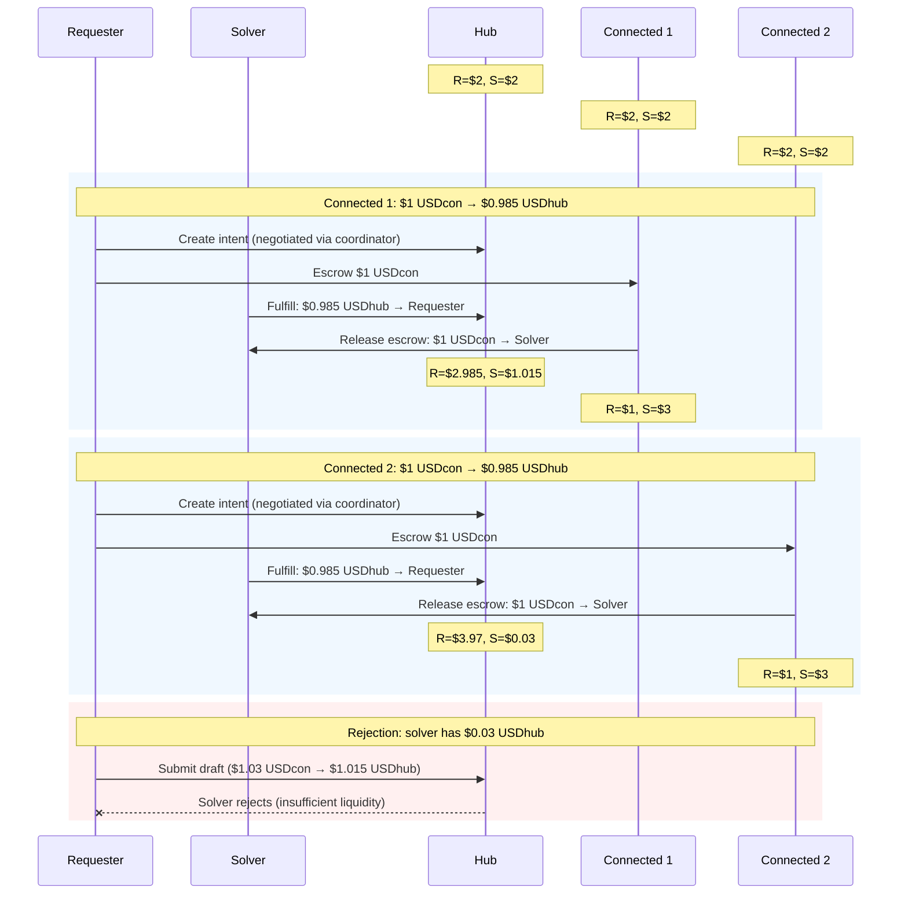
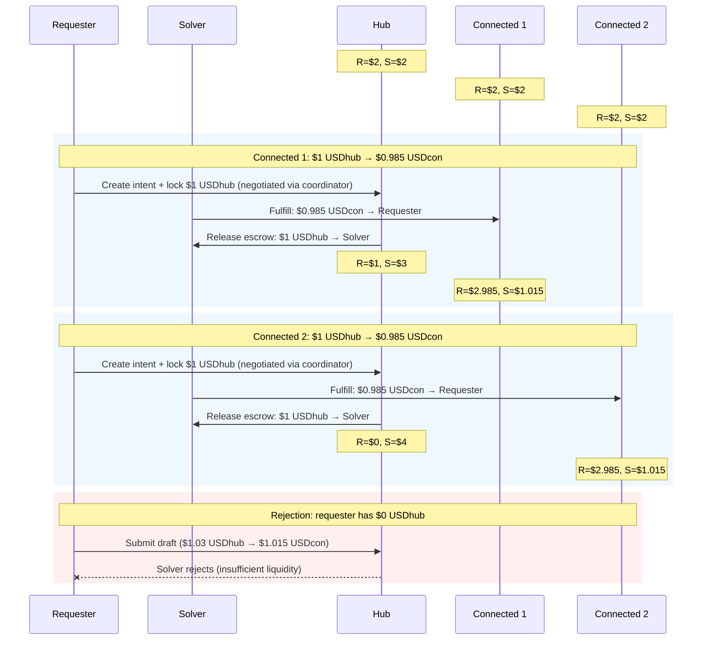

# Testing Infrastructure

## CI/E2E Tests

- [CI/E2E Tests](../../testing-infra/ci-e2e/) — Local E2E testing using Docker containers

## E2E Test Flows

All USD tokens use 6 decimals (1,000,000 units = \$1). Fee = \$0.015 per intent (1% base + 50 bps).
Each test runs two connected chains against the same hub. Hub balances carry; connected chains start fresh.

### Inflow (Connected Chain → Hub)

Requester offers USDcon on connected chain, wants USDhub on hub.

### Outflow (Hub → Connected Chain)

Requester offers USDhub on hub, wants USDcon on connected chain.

## Network Deployment

- [Supported Networks](./supported-networks.md) — Which networks are supported and deployment cost estimates
- [Network Deployment](../../testing-infra/networks/) — Deploy and configure scripts for testnet and mainnet
